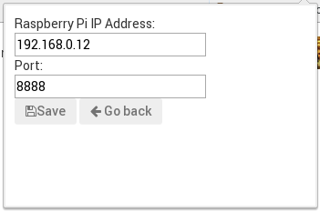
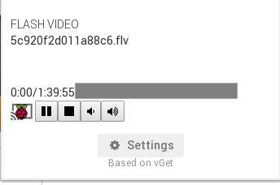

RPI-Cast
========

Raspberry PI ChromeCast-like server and Google Chrome extension


I am happy to present RPI-Cast a Google Chrome's extension that will turn your Raspberry PI into a Google Chromecast-like device. Once everything is installed and configured, you'll be able to play videos on your TV and command their reproduction (volume, pause-play and time) directly from your Google Chrome Browser (from your laptop or smart-phone devices).

# Installation instructions

## Client side

This is the easy part. First you need to download my RPI-cast extension ([RPI-cast](../lectures/RPI-cast.zip)) and import it on your Google Chrome browser (using the `chrome://extensions` configuration page). 

Inside the RPI-cast settings page use your Raspberry Pi IP address and store your configuration (the port I am using by default is 8888).





## Server side

This is the tricky part, two files are required on the Raspberry Pi:

### dbuscontrol.sh

[dbuscontrol.sh](dbuscontrol.sh) is used to send D-bus signals to Omxplayer (in order to change the volume, toogle pause and play, etc). This script should be placed inside `/usr/bin` or in a folder known by the `$PATH` environmental variable.

### websocket_server.py

[websocket_server.py](websocket_server.py) is a Python script that launches a server and listens all messages from the browser (your will need to install Tornado's Websockets package on the Raspberry PI).

### Systemd configuration file

The last thing to do is to run our `websocket_server.py` script automatically after booting the Raspberry Pi. I use Arch Linux for ARM, so `systemd` is my service manager, I just created a configuration file named `picast.service` which contains

``` bash
[Unit]
Description=Raspberry PI Cast Project
Requires=
Wants=

[Service]
User=root  
WorkingDirectory=/root
ExecStart=/root/websocket_server.py
PIDFile=/tmp/websocket_server.pid

[Install]
WantedBy=multi-user.target 
```

and I just put it inside `/etc/systemd/system`.

To enable the picast service we run `systemctl enable picast` and we can start it using `systemctl start picast`.


 

